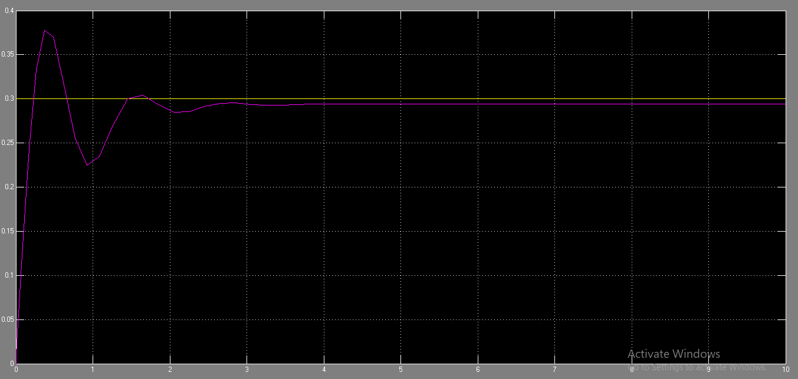
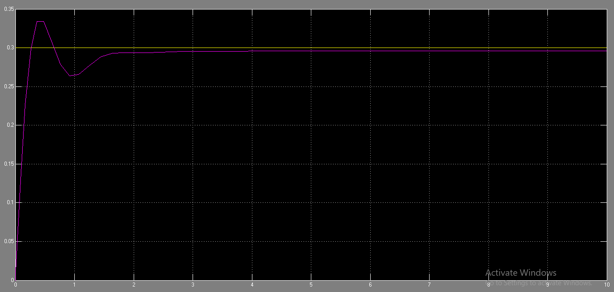
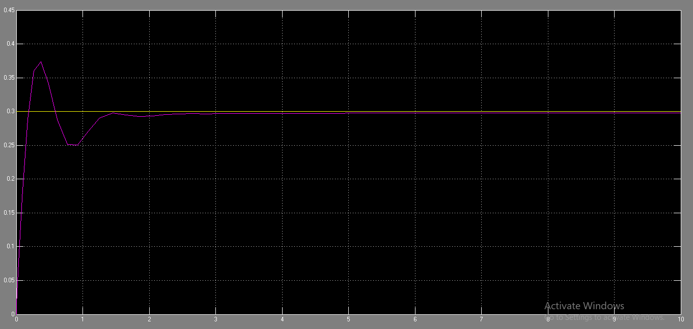
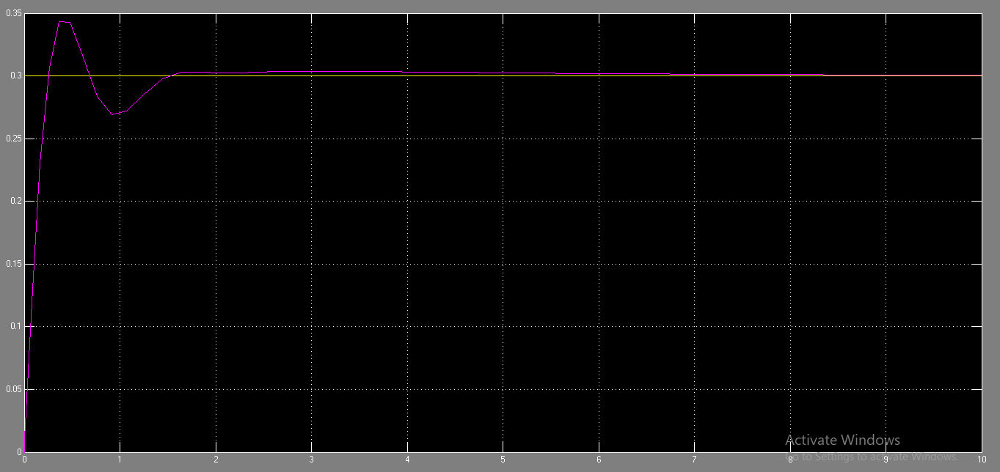

# Practical-Flow-Sensor
 This project features a motorized valve control mechanism within a pipe system. The valve adjusts fluid flow based on data from a flow sensor, which is compared to a set point by a controller. In a closed-loop system, both On/Off and PID (Proportional-Integral-Derivative) control strategies were tested and implemented to optimize performance.

# Tools Used:
-  Simulink: To module the p controllers(p-pi-pd-pid) for the closed loop system 
-  Arduino: To implement code for the pump and servo motor and water flow sensor and 6 modes (on/off- 50% set-point-4 p controllers)
   
## Output Graphs:
- ## P Output Graph: 
P controller has a large scaled maximum overshoot 

- ## PD Output Graph:
PD deravitive decrease the max overshoot comparing to the (0.3=50% setpoint)

- ## PI Output Graph:
 PI integral eliminates the error 

- ## PID Output Graph:
 PID integral-deravitive (p+pi+pd characteristics)

